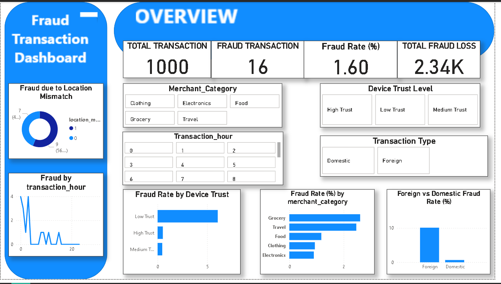

# FinTech Fraud Analytics Project

---

## 📌 Project Overview
This project focuses on analyzing **fraudulent digital transactions** to understand fraud patterns, high-risk behavior, and financial loss.  
The objective is to transform raw transaction data into **meaningful fraud insights** using **SQL and Power BI**.

---

## 🎯 Project Objectives
- Analyze transaction data to detect fraud patterns  
- Identify high-risk transactions based on behavior and device trust  
- Compare fraud across domestic and foreign transactions  
- Visualize fraud insights using an interactive dashboard  

---

## 🛠 Tools & Technologies Used
- **MySQL** – Data cleaning, transformation, and analysis  
- **Power BI** – Interactive dashboard creation and visualization  
- **Excel / CSV** – Initial data inspection and data transfer  

---

## 📊 Key KPIs
- **Total Transactions** – Overall number of transactions  
- **Fraud Transactions** – Total fraudulent transactions  
- **Fraud Rate (%)** – Percentage of fraud transactions  
- **Total Fraud Loss** – Financial loss due to fraud  

---

## 🔍 Analysis Performed
- Fraud comparison between **Domestic vs Foreign** transactions  
- Fraud analysis by **Device Trust Level**  
- Fraud trends based on **Transaction Hour**  
- Fraud rate by **Merchant Category**  
- Fraud impact due to **Location Mismatch**  

---

## 📈 Dashboard Highlights
- One-page executive-level dashboard  
- Interactive slicers for:
  - Merchant Category  
  - Transaction Hour  
  - Device Trust Level  
  - Transaction Type  
- Clean and business-focused visuals for quick decision-making  

---

## 🧠 Key Insights
- Low-trust devices show significantly higher fraud rates  
- Foreign transactions are more prone to fraud than domestic ones  
- Fraud activity increases during late-night hours  
- A small number of transactions contribute to most fraud losses  

---

## 📸 Dashboard Preview

---

## 👤 Author
**Ayush Raturi**  
Aspiring Data Analyst | MIS & Business Analytics  
Skills: SQL, Power BI, Excel, Data Analysis

